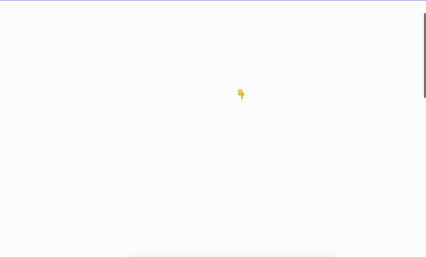

<!--
This README describes the package. If you publish this package to pub.dev,
this README's contents appear on the landing page for your package.

For information about how to write a good package README, see the guide for
[writing package pages](https://dart.dev/guides/libraries/writing-package-pages).

For general information about developing packages, see the Dart guide for
[creating packages](https://dart.dev/guides/libraries/create-library-packages)
and the Flutter guide for
[developing packages and plugins](https://flutter.dev/developing-packages).
-->

An unofficial dart wrapper for [GSAP](https://gsap.com/) (only free gsap).

This package works if you use dart web with webdev / [Jaspr](https://pub.dev/packages/jaspr) / and other dart web package ( not tested on Flutter).

You can create amazing animated web page:

 


⚠️
* Please before use it, read the [GSAP licence](https://gsap.com/community/standard-license/)
* This package was tested with GSAP 3.12.

## Features

Not all features of Gsap are implemented,  

| Lib/Plugin | Done | 
|----------|----------|
| Gsap | ✔️ | 
| Timeline | ✔️ | 
| Tween | ✔️| 
| Observer | ✔️| 
| Flip | ❌ | 
| ScrollTo | ✔️ | 
| Easel | ✔️ | 
| ScrollTrigger | ❌ | 
| Draggable | ❌ | 
| MotionPath | ❌ | 
| Text | ❌ | 
| RoughEase | ❌ | 
| ExpoScaleEase | ❌ | 
| SlowMo | ❌ | 
| CustomEase | ❌ | 
## Getting started

Add Gsap and others plugins in your index.html like this:

```html
<script src="https://cdnjs.cloudflare.com/ajax/libs/gsap/3.12.2/gsap.min.js"></script>
<script src="https://cdnjs.cloudflare.com/ajax/libs/gsap/3.12.2/ScrollToPlugin.min.js"></script>

```
## Usage

Example in dart web 

```dart
Future.delayed(Duration(milliseconds: 300), () {
      var tl = Gsap.timeline(TimeLineOptions(
          scrollTrigger: ScrollTriggerOptions(
              trigger: '.container',
              start: 'top center',
              end: '+=400',
              scrub: 1)));

      tl.from('.box', {
        'backgroundColor': '#28a92b',
        'rotation': 360,
        'scale': 0,
      });
    });

    final section = Element.section()
      ..children.addAll([
        Element.div()
          ..classes = ['section_scroll']
          ..children.add(HeadingElement.h2()..text = "Scroll down 👇"),
        Element.div()
          ..classes = ['section_scroll', 'container']
          ..children.add(Element.div()..classes = ['box']),
        Element.div()..classes = ['section_scroll'],
      ]);

```

You can find others examples for [dart](https://github.com/ande4485/dart_gsap/tree/main/examples_webdev) or for [jaspr](https://github.com/ande4485/dart_gsap/tree/main/examples_jaspr)

## Additional information

Please refer to the [Gsap doc](https://gsap.com/docs/v3/)

